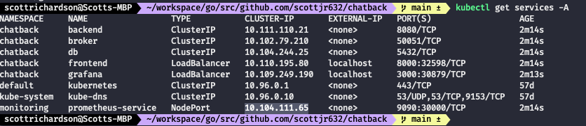

# Chatback - A K8s Application Example

<!-- toc -->
* [About This Project](#about-this-project)
* [Requirements](#requirements)
* [Getting Started](#getting-started)
    * [Components](#components)
    * [Scripts](#scripts)
    * [Monitoring](#monitoring)
* [Usage](#usage)
* [FAQ](#faq)
<!-- tocstop -->

## About this project

This project is an application that was built to help learn Kubernetes. There are multiple parts to this project and instructions on deploying each one. Each part of this project has already been build out and can be deployed on either a local kubernetes instance (e.g. docker-desktop or mini-kube) or deployed to a cloud provider like AKS (Azure Kubernetes Service).

## Requirements

- [Docker](https://www.docker.com/get-started)
- [Kubectl](https://kubernetes.io/docs/tasks/tools/install-kubectl/)
- Kubernetes (either)
    - [K8s for Docker Desktop](https://birthday.play-with-docker.com/kubernetes-docker-desktop/)
    - [Mini-Kube](https://minikube.sigs.k8s.io/docs/start/)
- [Docker Compose (optional)](https://docs.docker.com/compose/install/)

## Getting Started

This is an example chat application that can be deployed to any kubernetes cluster. There are several components to this application that are discussed below. 

### Components

**_Client_** - The client is the frontend of the application. This is what is visible from the browser. The client is a ReactJS application. More can be read about the client in the [client's README](client/README.md).

**_Server_** - The server is the main backend for the application. It is written in Golang and uses [Fiber](https://gofiber.io/) to serve requests and handle the websockets. More can be read about the server in the [server's README](server/README.md).

**_Broker_** - The broker's job is to broker messages from one server to another. Because there can be multiple servers, the broker's job is to ensure that each server get's the message sent from a client. [Broker's README](broker/README.md).

**_Database_** - PostgreSQL is used for the database and stores the messages sent.

### Scripts

There are several scripts that can help ease the deployment in the `scripts` directory.

`apply_all.sh` - will apply every service required for the chatback application. This includes the database, chatback, prometheus, and grafana and deploy them to the k8s cluster. Optionally, there is a `-l` flag that can be used to deploy the application from locally built docker images instead of using the pre-defined docker hub images.

`build_docker.sh` - will build all of the necessary docker images and save them locally.

`cleanup_k8s.sh` - will remove all the services for the chatback application.

`restart_all.sh` - will first run cleanup the k8s cluster then will build the local docker containers, and then will apply them all to the cluster. **_This is mainly used for local development and testing!_**

### Monitoring

Chatback uses prometheus and grafana to handle monitoring. Grafana uses a Load Balancer to expose the grafana service. This can be accessed on port 3000 on whichever IP that your service provider gives the Grafana load balancer.

If you are self-hosting k8s, then you can optionally change the type of the grafana service to be a Node Port.

To setup Grafana, navigate to the web UI. The default username will be admin / admin. This can be changed on your first login to whatever you like. You will then want to connect grafana to prometheus. This can be done by going to settings -> data source -> add data source. From there you will click on the Promethus tile. You will have to get the ClusterIP of the prometheus service to use as the URL for grafana. The ClusterIP can be obtained by using `kubectl get services -n monitoring`. 

Once you have the IP for prometheus, put the value `http://<ClusterIP>:9090` in the URL input. Scroll down to the bottom and press "save and test" if you get a green message you're good to go! If not ensure that the URL you put in is correct.

You are now ready to setup a dashboard! There are multiple custom dashboards already build that can be retrieved at [Dashboards](https://grafana.com/grafana/dashboards). To add a custom dashboard, go to plus icon on the right side of the screen, select import, and input the id of the dashboard that you want to use.

## Usage

The main application is exposed using a Load Balancer service. The IP assigned by your service provider can be retrieved by running `kubectl get services -n chatback` and will be the frontend service. You can then navigate to that URL at port `8000` to get to the main web UI.

## FAQ